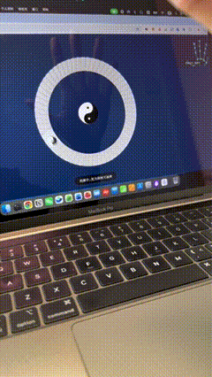

# 🧧64Gua — Gesture-Controlled I Ching Card Draw

**手势交互 · 64 卦抽卡系统**

An interactive, camera-based divination system where you draw I Ching (64 Hexagram) cards using your hand gestures.

一个基于摄像头的互动占卜系统，你用**手势**来抽取《易经》64 卦卡牌。



**No buttons. No UI controls. Your hand is the oracle.**

**没有按钮，没有点击。你的手，就是天机。**

## 🔗 Live Demo | 在线体验
### [👉 Click here to enter the Oracle / 点击进入占卜](https://flameaistudio.github.io/IChingCardDraw/)

---

## 🎴 What It Does | 它能做什么

Using your webcam and hand-tracking: **通过摄像头和手势识别：**

• **Open palm** → enter "ready to draw" state  
• **Point / hover** → select a card  
• **Fist** → confirm and reveal your hexagram

• **张开手掌** → 进入"准备抽卡"  
• **指向 / 悬停** → 选择一张牌  
• **握拳** → 确认并揭示你的卦象

The system randomly draws one of the 64 I Ching hexagrams, and presents its name and meaning.

系统会随机抽取 64 卦之一，并展示卦名与含义。

---

## ✨ Features | 功能

| English | 中文 |
|---------|------|
| Camera-based hand gesture control | 基于摄像头的手势交互 |
| 64-hexagram I Ching data system | 内置 64 卦数据系统 |
| Real-time visual feedback | 实时视觉反馈 |
| Ritual-style draw interaction | 仪式感抽卡体验 |
| No backend, no server, no install | 无后端、无服务器、无需安装 |

---

## 🛠 Tech Stack | 技术栈

- **HTML5**
- **Vanilla JavaScript**
- **CSS**
- **MediaPipe Hands** / Browser Camera API
- **Canvas** / DOM rendering

**No frameworks. No build tools. No dependencies.**

**无框架 无构建 纯前端**

---

## 🚀 How to Run | 运行方式

**English:**
1. Download or clone this repository
2. Open `index.html` in a modern browser
3. Allow camera access
4. Use your hand to draw a hexagram

**中文：**
1. 下载或克隆本仓库
2. 用浏览器打开 `index.html`
3. 允许摄像头权限
4. 用手势抽取你的卦象

If your browser blocks local camera access, use:  
**如果浏览器限制本地摄像头：**

```bash
python3 -m http.server
```

---

## 📂 Project Structure | 项目结构

| File | Purpose | 文件 | 作用 |
|------|---------|------|------|
| `index.html` | UI & layout | `index.html` | 页面与界面 |
| `styles.css` | Visual design | `styles.css` | 视觉样式 |
| `app.js` | Gesture logic | `app.js` | 手势与交互逻辑 |
| `guaData.js` | 64 hexagram data | `guaData.js` | 64 卦数据 |

---

## 🧠 Design Philosophy | 设计理念

This project treats **divination as a ritual**, not a button click.

**这个项目把占卜当成一种仪式，而不是一个按钮。**

It is designed to be:  
**它被设计为可以：**

• **Forked** • **Remixed** • **Reskinned** • **Reinterpreted**

• **被 Fork** • **被二次创作** • **换皮** • **文化再诠释**

Tarot, runes, oracle cards, astrology — this engine supports all of them.

**塔罗、符文、占星、神谕卡，这套引擎都可以支持。**

---

## 👤 About the Author | 作者

**Flame (FlameAIStudio)**

🏷️ **Global Indie Dev | AI Explorer | Traditional Culture Enthusiast**  
✍️ **Dev Logs | Growth Insights | AI Experiments | Daily Inspiration**

🏷️ **独立开发者｜AI探索者｜传统文化爱好者**  
✍️ **开发实录｜增长复盘｜AI实验｜日常灵感**

- [](https://github.com/FlameAIStudio)
- [](https://www.flameai.net/)
- [](https://xhslink.com/m/4hpU0mLDqkm)
- [](https://v.douyin.com/wdahg7Imp6M/)

<table>
  <tr>
    <td align="center">
      
      <br />
      公众号
    </td>
    <td align="center">
      
      <br />
      抖音
    </td>
    <td align="center">
      
      <br />
      小红书
    </td>
  </tr>
</table>

---

## 📜 License & Usage | 开源协议与初心

**MIT License**

**Note from the Author:**
I hope this source code serves as a tool for **education, dissemination, and inspiration**, helping more people explore traditional culture.
**Please do not sell this source code for profit.**
Let knowledge flow freely.

**作者寄语：**
开源这份代码，是希望它能真正用来 **传播、教学**，帮助更多人以现代化的视角接触传统文化。
**请勿将源代码直接进行商业售卖。**
愿这份“开源精神”与“传统智慧”一样，因分享而生生不息。
